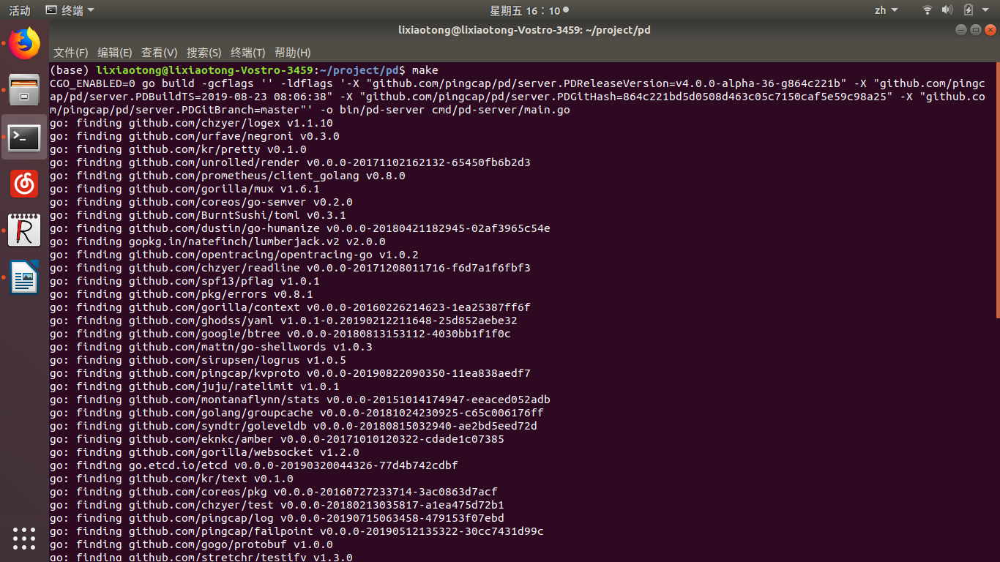

## notes on pd 3

> 本篇笔记将记录使用PD所遇到的问题以及解决方法，附PD的链接：https://github.com/pingcap/pd/tree/release-2.0

#### 设置

首先是基本的设置，在**Build**里面提到的make操作是最初阻碍我前进的一大障碍，经过询问前辈才得知，这个命令需要在命令行中进行。并且这种工程性任务最好在linux系统下进行。

