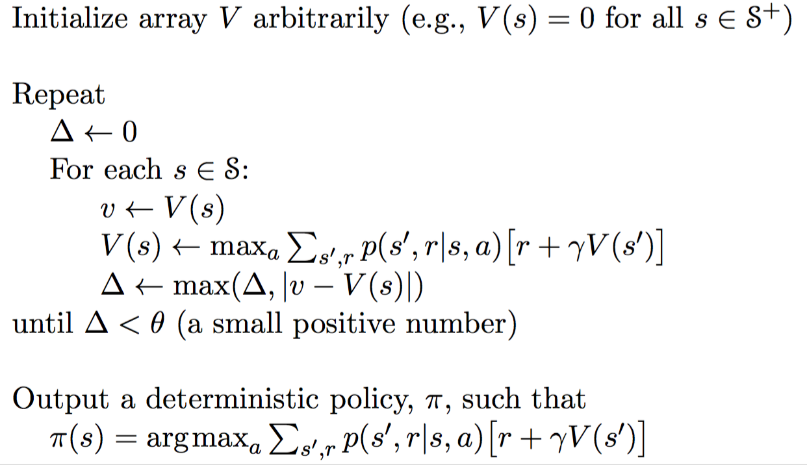

## Reinforcement Learning
> 一些简单易懂的例子：https://www.zhihu.com/question/41775291
* Markov decision processes
* Bellman equations
* Value Interation alg

#### Markov decision processes---MDP <S,A,T,R>

* states : $s \in S$
* actions : $a \in A$ 
* transitions : T(s,a,s') = P(s'|s,a) 在s状态下采取a行动最总到达s'的概率
* reward : R(s) R(s,a,s')...

**Utility function---be bounded in some way**

* Final horizon: 只计算n步的奖励
* Discounted rewards: $R(s0)+γR(s1)+γ^2R(s2)…$

**Policy**
每一步都可能有代价

#### Bellman Equations

贝尔曼方程（Bellman Equation），也被称为动态规划方程。贝尔曼方程将一个复杂的动态
规划问题拆解成小问题，进而方便求解

> 一个讲解BE的网上资源：https://zhuanlan.zhihu.com/p/35261164

$$V^*(s) = \max_{a}Q^*(s,a)$$
$$Q^*(s,a) = \sum_{s'}T(s,a,s')(R(s,a,s') + /gammaV^*(s'))$$

#### Value Interation alg

> https://blog.csdn.net/songrotek/article/details/51378582

$V^*_k(s)$: k步之后状态s的最佳value,当k趋向无穷大时，$V^*_k(s)$区域$V(s)$

**VI alg**

